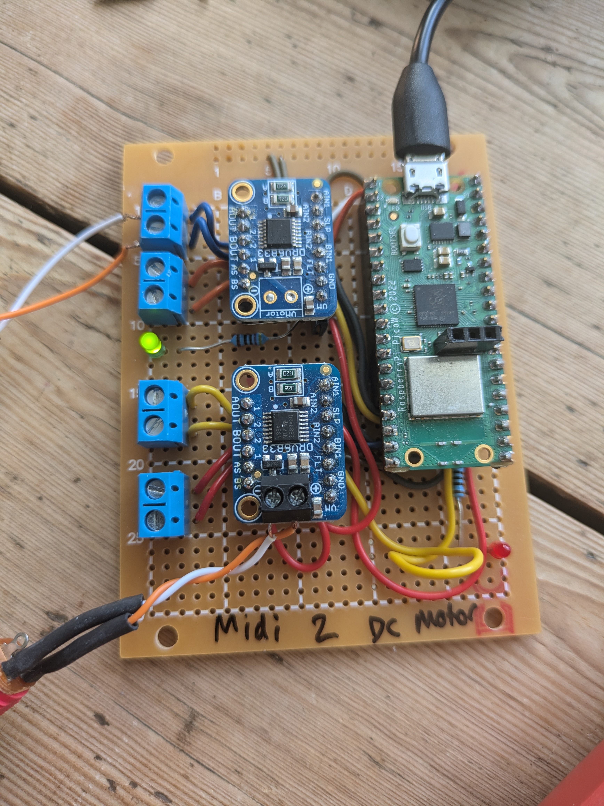

[](https://github.com/madskjeldgaard/raspberry-pi-pico-usbmidi-platformio-template/actions/workflows/build.yml)

# MIDI 2 DC Motor controller

 

This firmware will turn a Raspberry Pi Pico with two [DRV8833 motor controller boards](https://learn.adafruit.com/adafruit-drv8833-dc-stepper-motor-driver-breakout-board) into a USB Midi to DC Motor controller of sorts.

It maps midi notes to one of the 4 currently available channels and uses the velocity of the notes to set the speeds.

It also features a small auto sleep function which will activate the DRV8833's sleep mode when idle.

## Midi mapping

These are the midi messages expected by the device, and their effect.

In all note on messages, the velocity is mapped to the speed of the motor.


| midi message | motor | effect |
| ------------ | ----- | ------ |
| note on 48   | motor 1 a | reverse |
| note off 48  | motor 1 a | stop |
| note on 49   | motor 1 b | reverse |
| note off 49  | motor 1 b | stop |
| note on 50   | motor 2 a | reverse |
| note off 50  | motor 2 a | stop |
| note on 51   | motor 2 b | reverse |
| note off 51  | motor 2 b | stop |
| note on 60   | motor 1 a | forward |
| note off 60  | motor 1 a | stop |
| note on 61   | motor 1 b | forward |
| note off 61  | motor 1 b | stop |
| note on 62   | motor 2 a | forward |
| note off 62  | motor 2 a | stop |
| note on 63   | motor 2 b | forward |
| note off 63  | motor 2 b | stop |

## Dependencies

You need to have platformio installed to make use of this.

Install it on MacOS by running homebrew:

```bash
brew install platformio
```

## Compiling and uploading

To compile and upload your sketch, simply run the following command:

```bash
pio run -t upload
```
